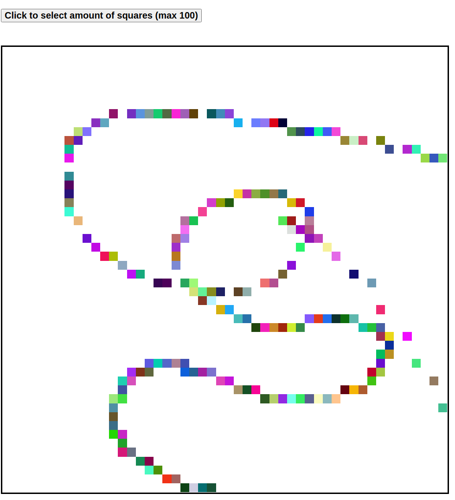

# 🎨 Etch-A-Sketch

This project is part of **The Odin Project's Foundation curriculum**, where I created a browser-based version of an **Etch-A-Sketch** toy. This project emphasizes DOM manipulation and CSS layout techniques, specifically using **Flexbox**.

## 🌟 Features

- Create a customizable grid for drawing, starting with a default size of 16x16 squares.
- Change the color of the squares as you hover over them, leaving a pixelated trail.
- A button allows users to prompt for a new grid size, with a maximum of 100 squares per side.
- Bonus features include random colors for each square and a progressive darkening effect.

## 🚀 Technologies Used

- **HTML5**: For the basic structure of the webpage.
- **CSS**: For styling and layout using Flexbox.
- **JavaScript**: For the grid generation and hover functionality.

## 📸 Preview

You can try out the Etch-A-Sketch tool here: [Live Demo](https://mrswizzer.github.io/odin-etch-a-sketch)

## 💡 Learning Outcomes

Through this project, I practiced the following skills:

- Creating and manipulating the DOM with **JavaScript** to generate elements dynamically.
- Applying **CSS Flexbox** to layout the grid of squares effectively.
- Handling user inputs with prompts and buttons to enhance interactivity.
- Implementing hover effects and event listeners to change styles on user interaction.
- Managing the project using **Git** and pushing it to **GitHub**.

---

## 🔗 Acknowledgments

This project was built as part of [The Odin Project](https://www.theodinproject.com/)'s curriculum. The guidance and problem-solving approach provided by the project helped solidify my understanding of JavaScript and web development fundamentals.
